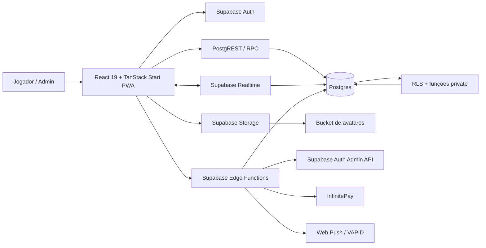
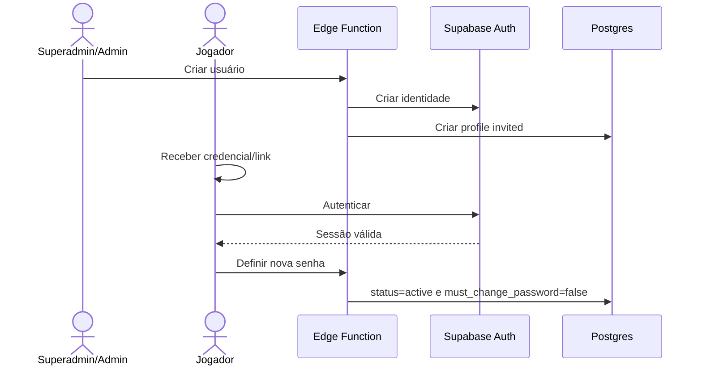
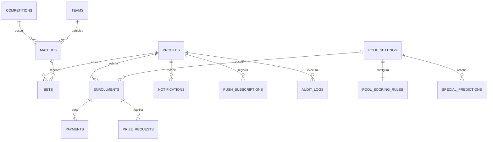
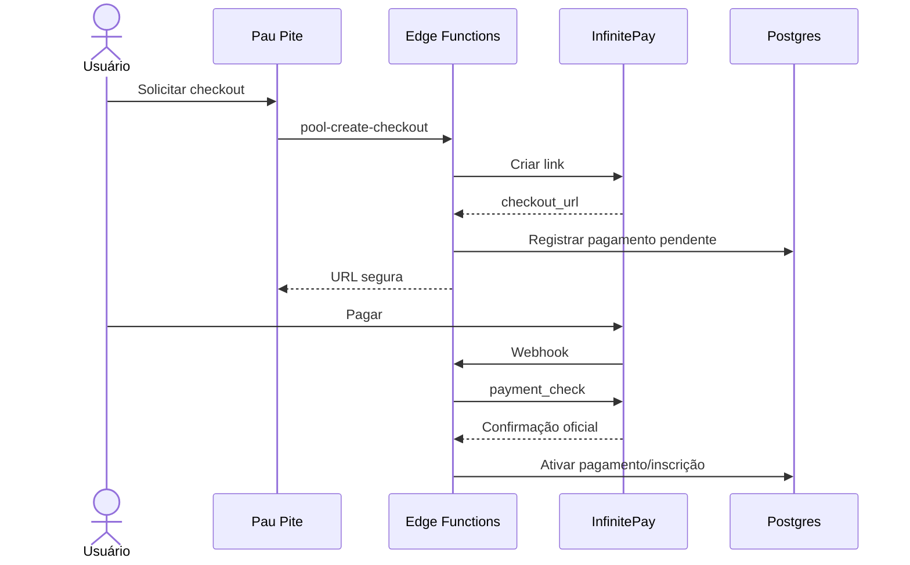

<div align="center">
  

  # Pau Pite

  **Bolão privado, mobile-first e instalável para a Copa do Mundo de 2026.**

  Palpites por partida, mata-mata com prorrogação e pênaltis, ranking em tempo real, gestão de usuários, notificações, pagamentos e administração protegida por RBAC + RLS.

  <p>
    
    
    
    
    
    
    
  </p>
</div>

---

## Sumário

- [Visão geral](#visão-geral)
- [Principais recursos](#principais-recursos)
- [Arquitetura](#arquitetura)
- [Papéis e permissões](#papéis-e-permissões)
- [Fluxos principais](#fluxos-principais)
- [Pontuação](#pontuação)
- [Stack](#stack)
- [Estrutura do repositório](#estrutura-do-repositório)
- [Banco de dados](#banco-de-dados)
- [Edge Functions](#edge-functions)
- [Execução local](#execução-local)
- [Configuração do Supabase](#configuração-do-supabase)
- [PWA e notificações push](#pwa-e-notificações-push)
- [Pagamentos](#pagamentos)
- [Segurança](#segurança)
- [Testes e validação](#testes-e-validação)
- [Deploy e fluxo Git](#deploy-e-fluxo-git)
- [Regras para evolução](#regras-para-evolução)
- [Solução de problemas](#solução-de-problemas)
- [Roadmap](#roadmap)

## Visão geral

O **Pau Pite** é uma aplicação web privada para organizar um bolão entre participantes convidados durante a Copa do Mundo de 2026.

O produto foi construído para funcionar como aplicação real, não como dashboard genérico: navegação mobile-first, cards grandes de partidas, bandeiras locais, estados operacionais claros, ranking vivo, perfis públicos controlados e instalação como PWA.

O acesso não é público. Contas são criadas exclusivamente por operadores autorizados, respeitando a hierarquia:

```text
superadmin > admin > player
```

O sistema separa responsabilidades entre frontend, Postgres, RLS, RPCs e Edge Functions. A regra crítica não depende apenas da interface: bloqueio de palpites, administração, cálculo de pontos, gestão de usuários e pagamentos possuem validação server-side.

## Principais recursos

### Para jogadores

- Login privado por e-mail e senha.
- Primeiro acesso com troca obrigatória de senha.
- Recuperação de acesso direcionada ao administrador via WhatsApp.
- Agenda diária de partidas da Copa 2026.
- Palpites editáveis somente antes do início da partida.
- Palpites de mata-mata com:
  - placar;
  - classificado;
  - vitória no tempo regulamentar;
  - vitória na prorrogação;
  - decisão por pênaltis.
- Exibição do palpite após o início do jogo.
- Ranking da resenha e ranking oficial do bolão.
- Movimentação de posição no ranking.
- Perfil com nickname, avatar e preferências visuais.
- Histórico de palpites permitidos no perfil público.
- Central de notificações com leitura em tempo real.
- Notificações web push em navegadores compatíveis.
- Instalação como aplicativo no Android, iOS e desktop.
- Tema claro/escuro.

### Para administração

- Criação de usuários sem cadastro público.
- Gestão de `player`, `admin` e `superadmin` conforme hierarquia.
- Proteção contra remoção/rebaixamento do último `superadmin`.
- Definição de senha temporária e troca obrigatória.
- Ativação, suspensão e gestão de perfis.
- Cadastro, importação e edição de partidas.
- Atualização de status e placar.
- Resultado de mata-mata com placar regulamentar, placar final, classificado e método.
- Encerramento de partida e recálculo de pontos.
- Configuração do bolão, inscrição, taxa e premiação.
- Confirmação manual de participantes e pagamentos.
- Integração opcional com InfinitePay.
- Campanhas internas de notificação.
- Relatório e exclusão de campanhas enviadas.
- Auditoria persistida para ações críticas.

### Dados e experiência

- Fase de grupos e mata-mata representados em JSON versionado.
- Bandeiras servidas localmente em `public/flags`.
- Realtime do Supabase para partidas, ranking, pagamentos e notificações.
- Cache da aplicação coordenado por TanStack Query.
- Componentes acessíveis baseados em Radix UI e shadcn/ui.
- Layout responsivo com foco inicial em celular.

## Arquitetura



### Princípios da arquitetura

1. **Frontend não é fonte de autoridade.** Controles visuais melhoram UX, mas permissões críticas são repetidas no backend.
2. **RLS é obrigatória.** Acesso às tabelas depende do usuário autenticado e do papel armazenado no perfil.
3. **Service role fica no servidor.** Chave privilegiada é usada somente por Edge Functions ou ambiente server-side seguro.
4. **Pontuação é calculada no banco.** O frontend exibe resultados; não define pontuação oficial.
5. **Realtime é otimização, não requisito de consistência.** Refetch periódico e invalidação de cache complementam eventos realtime.
6. **Dados oficiais e palpites são separados.** Resultado da partida nunca é inferido do palpite do usuário.

## Papéis e permissões

| Ação | `player` | `admin` | `superadmin` |
| --- | :---: | :---: | :---: |
| Acessar partidas e ranking | Sim | Sim | Sim |
| Criar/editar próprio palpite antes do kickoff | Sim | Sim | Sim |
| Editar próprio perfil não sensível | Sim | Sim | Sim |
| Criar `player` | Não | Sim | Sim |
| Criar `admin` | Não | Não | Sim |
| Criar/rebaixar `superadmin` | Não | Não | Protegido |
| Gerenciar usuários operacionais | Não | Limitado | Sim |
| Alterar resultado oficial | Não | Sim | Sim |
| Recalcular pontuação | Não | Sim | Sim |
| Configurar bolão/pagamentos | Não | Conforme policy | Sim |
| Ver dados administrativos sensíveis | Não | Limitado | Sim |

> A matriz acima descreve a intenção funcional. A regra efetiva depende da combinação entre RLS, funções SQL, Edge Functions e frontend.

## Fluxos principais

### 1. Convite e primeiro acesso



Não existe `signUp` público. Usuário convidado ou com senha temporária é redirecionado para `/reset-password` até concluir a troca.

### 2. Registro de palpite

1. Aplicação carrega partida e palpite existente.
2. Status temporal é derivado usando `kickoff_at`.
3. Palpite só fica editável com status permitido e kickoff futuro.
4. Frontend valida placar e campos de mata-mata.
5. RLS/triggers confirmam usuário, partida e prazo.
6. Após kickoff, palpite fica bloqueado.
7. Durante a partida, palpite pode ser exibido no histórico público permitido.

### 3. Resultado e pontuação

1. Operador informa resultado oficial.
2. Em mata-mata, resultado diferencia placar regulamentar e placar final.
3. Sistema valida classificado e método de classificação.
4. Partida é encerrada.
5. RPC/função privada recalcula todos os palpites da partida.
6. Breakdown de pontos é salvo no palpite.
7. Views de ranking refletem nova pontuação.
8. Eventos de movimentação registram subida ou queda no ranking.
9. Notificações de pontuação podem ser criadas para os participantes.

### 4. Inscrição no bolão oficial

1. Jogador aceita os termos.
2. Solicita inscrição.
3. Pagamento pode ser confirmado manualmente ou via checkout.
4. Inscrição ativa libera participação no ranking oficial.
5. Ranking da resenha continua independente da confirmação financeira.

## Pontuação

As regras são configuráveis no banco e no módulo administrativo. Os valores abaixo são os padrões presentes no projeto.

### Fase de grupos

| Acerto | Pontos padrão |
| --- | ---: |
| Placar exato | 5 |
| Bônus de saldo no placar exato | +1 |
| Resultado correto: vitória/empate | 3 |
| Saldo correto sem placar exato | +1 |
| Resultado incorreto | 0 |

Exemplos:

```text
Resultado: 2 x 1
Palpite:   2 x 1  → 6 pontos
Palpite:   3 x 2  → 4 pontos
Palpite:   1 x 0  → 4 pontos
Palpite:   3 x 1  → 3 pontos
Palpite:   1 x 1  → 0 pontos
```

### Mata-mata

Pontos-base padrão:

| Critério | Pontos-base |
| --- | ---: |
| Placar exato | 3 |
| Resultado no tempo regulamentar | 1 |
| Saldo de gols | 1 |
| Time classificado | 2 |
| Método de classificação | 1 |
| Combinação perfeita | 1 |

Fórmula:

```text
pontos = arredondar(pontos-base × peso da fase × multiplicador da seleção)
```

Pesos padrão:

| Fase | Peso |
| --- | ---: |
| Fase de 32 | 1x |
| Oitavas | 2x |
| Quartas | 3x |
| Semifinal | 4x |
| Disputa de 3º lugar | 3x |
| Final | 6x |

### Palpites especiais

| Palpite | Pontos padrão |
| --- | ---: |
| Campeão | 60 |
| Vice-campeão | 35 |
| Terceiro lugar | 25 |
| Artilheiro | 40 |
| Pódio perfeito | 30 |

### Desempate do ranking

Ordem implementada nas views de ranking:

1. maior pontuação total;
2. mais placares exatos;
3. mais classificados corretos no mata-mata;
4. mais combinações perfeitas no mata-mata;
5. mais pontos especiais;
6. mais palpites válidos;
7. primeiro palpite válido enviado mais cedo;
8. nome em ordem alfabética como fallback técnico.

## Stack

### Frontend

- React 19.
- TypeScript.
- TanStack Start.
- TanStack Router com file-based routing.
- TanStack Query.
- Vite 8.
- Tailwind CSS 4.
- shadcn/ui.
- Radix UI.
- React Hook Form.
- Zod.
- date-fns.
- Recharts.
- Lucide React e React Icons.

### Backend

- Supabase Auth.
- PostgreSQL.
- Row Level Security.
- Views, triggers, RPCs e funções `SECURITY DEFINER` controladas.
- Supabase Realtime.
- Supabase Storage.
- Supabase Edge Functions em Deno.

### Plataforma

- Lovable para edição e publicação.
- GitHub para versionamento e revisão.
- PWA com Web App Manifest e Service Worker.
- InfinitePay como integração opcional de pagamento.
- Web Push com VAPID.

## Estrutura do repositório

```text
.
├── public/
│   ├── flags/                  # bandeiras locais
│   ├── icons/                  # ícones PWA
│   ├── manifest.webmanifest
│   └── sw.js                   # cache e notificações push
├── src/
│   ├── components/
│   │   ├── admin/              # módulos administrativos
│   │   ├── mobile/             # shell e componentes mobile-first
│   │   ├── notifications/      # central de notificações
│   │   ├── profile/            # avatar e perfil
│   │   ├── theme/              # efeitos e temas
│   │   └── ui/                 # componentes shadcn/radix
│   ├── data/                   # seeds JSON Copa 2026
│   ├── hooks/                  # auth, PWA, push, tema e notificações
│   ├── integrations/supabase/  # clientes, middleware e tipos gerados
│   ├── lib/                    # domínio, ranking, partidas e validações
│   └── routes/                 # rotas TanStack Start
├── supabase/
│   ├── functions/              # Edge Functions
│   ├── migrations/             # histórico SQL ordenado
│   └── config.toml
├── tests/                      # testes do fluxo de resultado admin
├── docs/                       # diagnóstico, UX e entrega do MVP
├── AGENTS.md                   # restrições do sync Lovable
├── CLAUDE.md                   # contexto técnico para agentes
└── package.json
```

### Rotas

| Rota | Acesso | Responsabilidade |
| --- | --- | --- |
| `/` | Público | Resolve sessão e redireciona |
| `/auth` | Público | Login privado e suporte via administrador |
| `/reset-password` | Autenticado/recuperação | Primeiro acesso e troca de senha |
| `/home` | Autenticado | Partidas e palpites |
| `/pool` | Autenticado | Inscrição, pagamento, especiais e prêmios |
| `/ranking` | Autenticado | Ranking livre e oficial |
| `/profile` | Autenticado | Perfil, avatar, PWA e notificações |
| `/admin` | `admin`/`superadmin` | Operação do sistema |

> `src/routeTree.gen.ts` é gerado automaticamente. Não editar manualmente.

## Banco de dados

### Entidades principais

| Entidade | Responsabilidade |
| --- | --- |
| `profiles` | perfil, role, status e preferências do usuário |
| `teams` | seleções, códigos, nomes e bandeiras |
| `competitions` | competição/temporada |
| `matches` | agenda, status, placar, mata-mata e fontes do chaveamento |
| `bets` | palpite, campos de classificação, pontos e breakdown |
| `score_rules` | regras da fase de grupos |
| `pool_settings` | configuração pública e operacional do bolão |
| `pool_scoring_rules` | pesos, pontos-base, multiplicadores e especiais |
| `special_predictions` | campeão, vice, terceiro e demais especiais |
| `enrollments` | inscrição do participante no bolão oficial |
| `payments` | cobrança, checkout, confirmação e comprovante |
| `prize_requests` | solicitação e pagamento de prêmio |
| `notifications` | notificações individuais |
| `notification_campaigns` | campanhas administrativas |
| `push_subscriptions` | endpoints Web Push do usuário |
| `ranking_position_snapshots` | snapshots de posição |
| `ranking_position_movement_events` | eventos de subida/queda |
| `match_imports` | histórico de importações JSON |
| `audit_logs` | trilha de ações críticas |

### Views principais

- `ranking_free`
- `ranking_pool`
- `ranking_current_movement_events`
- `ranking_latest_movement_events`
- `pool_public_summary`
- `match_bet_trends`

### RPCs/funções públicas relevantes

- `admin_finalize_match_result`
- `admin_recalculate_match_points`
- `admin_refresh_ranking_position_snapshots`
- `admin_set_match_status`
- `admin_update_match_score`
- `calc_bet_points`
- `get_public_profile_closed_bets`

### Modelo simplificado



## Edge Functions

| Função | Responsabilidade |
| --- | --- |
| `admin-create-user` | criar identidade e perfil respeitando hierarquia |
| `admin-manage-user` | alterar dados administrativos do usuário |
| `admin-reset-user-password` | fluxo legado/controlado de reset |
| `admin-set-temp-password` | definir senha temporária e forçar troca |
| `complete-password-change` | concluir primeiro acesso/troca obrigatória |
| `admin-save-match` | salvar estado e resultado de partida |
| `recalculate-match-points` | acionar recálculo protegido |
| `import-matches` | importar agenda JSON com validação |
| `admin-notifications` | enviar, consultar e excluir campanhas |
| `pool-enrollment` | solicitar, confirmar e administrar inscrição |
| `pool-create-checkout` | criar checkout InfinitePay |
| `infinitepay-webhook` | receber confirmação e validar pagamento |
| `infinitepay-payment-check` | verificar transação server-side |
| `push-subscriptions` | registrar/remover assinatura Web Push |
| `push-dispatch` | enviar push para assinaturas ativas |

As funções usam `verify_jwt = false` no gateway e fazem validação explícita do bearer token internamente. Isso **não** significa acesso anônimo. Remover a validação interna cria vulnerabilidade crítica.

## Execução local

### Pré-requisitos

- Node.js.
- npm.
- Projeto Supabase compatível com as migrations do repositório.
- Variáveis públicas do Supabase.

### Instalação

```bash
git clone <URL_DO_REPOSITORIO>
cd paupite
npm install
```

Crie o arquivo local de ambiente:

```bash
cp .env.example .env
```

No PowerShell:

```powershell
Copy-Item .env.example .env
```

Preencha:

```env
VITE_SUPABASE_URL=https://SEU_PROJETO.supabase.co
VITE_SUPABASE_PUBLISHABLE_KEY=SUA_CHAVE_PUBLICA
VITE_SUPABASE_PROJECT_ID=SEU_PROJECT_ID
```

Execute:

```bash
npm run dev
```

### Scripts disponíveis

| Comando | Uso |
| --- | --- |
| `npm run dev` | servidor local Vite |
| `npm run build` | build de produção |
| `npm run build:dev` | build em modo development |
| `npm run preview` | preview do build |
| `npm run lint` | análise ESLint |
| `npm run test` | suíte atual de testes |
| `npm run test:admin-result-flow` | valida fluxo de resultado administrativo |
| `npm run format` | formatação Prettier |

## Configuração do Supabase

### 1. Migrations

As migrations ficam em:

```text
supabase/migrations/
```

Aplicar em ordem crescente pelo nome do arquivo. Não executar trechos isolados nem pular migrations intermediárias.

Fluxo manual usado pelo projeto:

1. Abrir **Supabase Dashboard → SQL Editor**.
2. Confirmar qual foi a última migration aplicada.
3. Executar os arquivos seguintes em ordem.
4. Validar tabelas, views, funções, triggers e policies.
5. Registrar qualquer divergência de schema antes de alterar código.

### 2. Deploy das Edge Functions

Fazer deploy pelo ambiente Supabase/Lovable conectado ao projeto. Todas as funções listadas em `supabase/config.toml` precisam existir no mesmo projeto usado pelo frontend.

### 3. Secrets

Fornecidos automaticamente pelo Supabase:

```text
SUPABASE_URL
SUPABASE_SERVICE_ROLE_KEY
SUPABASE_ANON_KEY ou SUPABASE_PUBLISHABLE_KEY
```

Integração InfinitePay:

```text
INFINITEPAY_HANDLE
APP_PUBLIC_URL
INFINITEPAY_WEBHOOK_TOKEN
```

Web Push:

```text
VAPID_PUBLIC_KEY
VAPID_PRIVATE_KEY
VAPID_SUBJECT
PUSH_WEBHOOK_SECRET
```

Nunca prefixar secret privado com `VITE_`. Variáveis `VITE_*` são incorporadas ao bundle do navegador.

## PWA e notificações push

O projeto inclui:

- `public/manifest.webmanifest`;
- ícones `192x192` e `512x512`;
- ícones maskable;
- `apple-touch-icon`;
- `public/sw.js`;
- prompt nativo de instalação quando suportado;
- guia alternativo para plataformas sem prompt;
- eventos `push` e `notificationclick`;
- abertura segura apenas de rotas internas.

### Comportamento por plataforma

- **Android/Chromium:** usa `beforeinstallprompt` quando o navegador disponibiliza o evento.
- **iOS/iPadOS:** instalação é manual via “Adicionar à Tela de Início”. Push exige o app instalado em modo standalone e versão compatível do sistema.
- **Desktop Chromium:** pode exibir instalação na barra de endereço ou pelo menu do navegador.

O Service Worker registra somente em build de produção. Testar PWA via domínio HTTPS ou ambiente local compatível.

## Pagamentos

A integração automática é opcional. Sem os secrets da InfinitePay, o fluxo manual continua utilizável.

Fluxo protegido:



A URL de retorno nunca ativa inscrição diretamente. A confirmação oficial ocorre server-side.

## Segurança

### Regras obrigatórias

- Não existe cadastro público.
- `player` não cria usuários.
- `player` não altera role.
- `player` não altera resultado oficial.
- `player` não manipula pontuação.
- `player` não acessa dados administrativos sensíveis.
- Último `superadmin` deve permanecer protegido.
- Palpite não pode ser criado ou editado após kickoff.
- `service_role` nunca deve chegar ao frontend.
- Senhas e tokens nunca devem ser logados.
- Resultado e pontuação oficial devem ser alterados apenas por fluxo autorizado.

### Chaves públicas x privadas

Permitidas no frontend:

```text
VITE_SUPABASE_URL
VITE_SUPABASE_PUBLISHABLE_KEY
VITE_SUPABASE_PROJECT_ID
```

Proibidas no frontend/repositório:

```text
SUPABASE_SERVICE_ROLE_KEY
VAPID_PRIVATE_KEY
INFINITEPAY_WEBHOOK_TOKEN
PUSH_WEBHOOK_SECRET
senhas
SMTP password
qualquer secret real
```

### Atenção ao `.env`

O arquivo `.env` deve permanecer local e fora do histórico Git. Antes de publicar ou abrir PR:

```bash
git status
git ls-files .env
```

Se `.env` aparecer como arquivo rastreado, remova-o do índice e rotacione qualquer credencial que já tenha sido publicada.

## Testes e validação

### Validação automatizada

```bash
npm install
npm run lint
npm run test
npm run build
```

### Smoke test funcional

#### Auth

- Login com usuário ativo.
- Primeiro acesso com senha temporária.
- Redirecionamento para troca obrigatória.
- Ausência de cadastro público.
- Botão de suporte via WhatsApp.

#### RBAC

- `player` bloqueado em `/admin`.
- `admin` sem capacidade de criar `admin`.
- `superadmin` capaz de criar `admin` e `player`.
- Tentativa de rebaixar/remover último `superadmin` rejeitada.

#### Palpites

- Criar palpite antes do kickoff.
- Editar palpite antes do kickoff.
- Bloquear edição após kickoff.
- Validar empate + pênaltis.
- Validar vitória na prorrogação.
- Confirmar persistência após recarregar.

#### Resultado

- Atualizar jogo para “Em andamento”.
- Encerrar jogo da fase de grupos.
- Encerrar mata-mata com placar regulamentar e final diferentes.
- Recalcular pontos.
- Conferir breakdown e ranking.

#### Realtime

- Nova notificação sem F5.
- Exclusão de campanha refletida no usuário.
- Atualização do ranking.
- Confirmação de inscrição/pagamento.

#### PWA

- Manifest válido.
- Ícones carregando.
- Instalação Android/desktop.
- Guia iOS.
- Service Worker ativo em produção.
- Push abrindo rota interna segura.

## Deploy e fluxo Git

O repositório é sincronizado com Lovable. Commits enviados para a branch conectada aparecem no editor.

> Não reescrever histórico publicado. Evitar `force-push`, rebase, amend ou squash de commits que já foram enviados ao Lovable.

Fluxo recomendado:

```bash
git checkout main
git pull origin main
git checkout -b feat/nome-curto-da-tarefa

npm install
npm run lint
npm run test
npm run build

 git status
 git add .
 git commit -m "feat: descrição objetiva"
 git push -u origin feat/nome-curto-da-tarefa
```

Depois:

1. Abrir Pull Request.
2. Revisar diff.
3. Validar preview.
4. Executar smoke test.
5. Fazer merge sem reescrever histórico publicado.
6. Publicar pelo Lovable quando necessário.

## Regras para evolução

Antes de alterar código, classificar demanda:

- bug;
- melhoria visual;
- regra de negócio;
- arquitetura;
- segurança;
- governança;
- débito técnico.

Toda mudança deve declarar:

1. objetivo;
2. impacto técnico;
3. arquivos prováveis;
4. o que não será alterado;
5. risco;
6. rollback;
7. critério de aceite.

Áreas que exigem análise e autorização explícita:

- autenticação;
- RLS;
- RBAC;
- policies;
- Edge Functions;
- schema crítico;
- cálculo de ranking;
- regras de pontuação;
- criação/reset de usuários;
- JSON oficial;
- importação de bandeiras;
- rotas protegidas.

Preferir mudanças pequenas, validáveis e reversíveis. Evitar combinar refatoração estrutural, mudança visual e regra de negócio na mesma entrega.

## Solução de problemas

### App abre sem dados

Verifique:

```text
VITE_SUPABASE_URL
VITE_SUPABASE_PUBLISHABLE_KEY
VITE_SUPABASE_PROJECT_ID
```

Confirme também que migrations e Edge Functions pertencem ao mesmo projeto Supabase.

### Erro de coluna/tabela inexistente

Provável schema drift. Compare o banco remoto com `supabase/migrations` e aplique migrations pendentes em ordem.

### Usuário entra, mas volta para troca de senha

Confira em `profiles`:

```text
status
must_change_password
```

Usuário convidado ou com senha temporária permanece no fluxo de troca até conclusão server-side.

### Palpite aparece bloqueado antes do horário

Confirme:

- timezone gravado em `kickoff_at`;
- relógio do dispositivo;
- status da partida;
- valor UTC no banco;
- conversão exibida no frontend.

### Partida em andamento aparece agendada/encerrada

O status visual combina `status` persistido com `kickoff_at`. Verifique ambos antes de corrigir somente a UI.

### Pontuação não atualiza

Verifique:

- status da partida;
- resultado oficial;
- `qualified_team_id` e `qualification_method` em mata-mata;
- execução da função de recálculo;
- `bets.points` e `knockout_points_breakdown`;
- views `ranking_free` e `ranking_pool`.

### Instalação PWA não aparece

O navegador controla o prompt. Requisitos comuns:

- HTTPS;
- manifest válido;
- Service Worker registrado;
- app ainda não instalado;
- critérios de engajamento do navegador atendidos.

### Push indisponível no iPhone

Instale o PWA pela Tela de Início e abra o app em modo standalone antes de solicitar permissão.

### Pagamento permanece pendente

Confirme os secrets InfinitePay, webhook, `payment_check`, `order_nsu`, `transaction_nsu`, valor e status da inscrição. Não ativar manualmente pela URL de retorno.

## Roadmap

### Prioridade atual

- Estabilizar fluxo completo de partidas e pontuação.
- Consolidar schema remoto com todas as migrations.
- Aumentar cobertura de testes do ranking e mata-mata.
- Validar PWA/push em Android e iOS reais.
- Validar pagamento com transação controlada de baixo valor.
- Reduzir dependência de correções manuais no SQL Editor.

### Próximas evoluções

- Tela de auditoria administrativa.
- Suite de testes para RLS/RBAC.
- Testes end-to-end.
- CI com lint, test e build em Pull Requests.
- Exportação administrativa controlada.
- Histórico detalhado por rodada/fase.
- Regras avançadas de desempate somente após validação formal.
- Sincronização segura com fonte oficial de resultados.

## Documentação complementar

- [`docs/ENTREGA_MVP.md`](./docs/ENTREGA_MVP.md)
- [`docs/diagnostico-inicial.md`](./docs/diagnostico-inicial.md)
- [`docs/mobile-navigation.md`](./docs/mobile-navigation.md)
- [`docs/wireframes-mobile.md`](./docs/wireframes-mobile.md)
- [`docs/referencia-visual.md`](./docs/referencia-visual.md)
- [`docs/component-map.md`](./docs/component-map.md)
- [`docs/pendencias-lovable.md`](./docs/pendencias-lovable.md)
- [`CLAUDE.md`](./CLAUDE.md)
- [`AGENTS.md`](./AGENTS.md)

## Licenças e ativos

As bandeiras locais possuem licença registrada em:

```text
public/flags/LICENSE-flag-icons.txt
```

O projeto é de uso privado. Defina uma licença explícita antes de distribuir ou abrir o código publicamente.

---

<div align="center">
  <strong>Pau Pite</strong><br />
  Bolão privado da Copa 2026 — segurança no backend, experiência no mobile e resenha no ranking.
</div>
